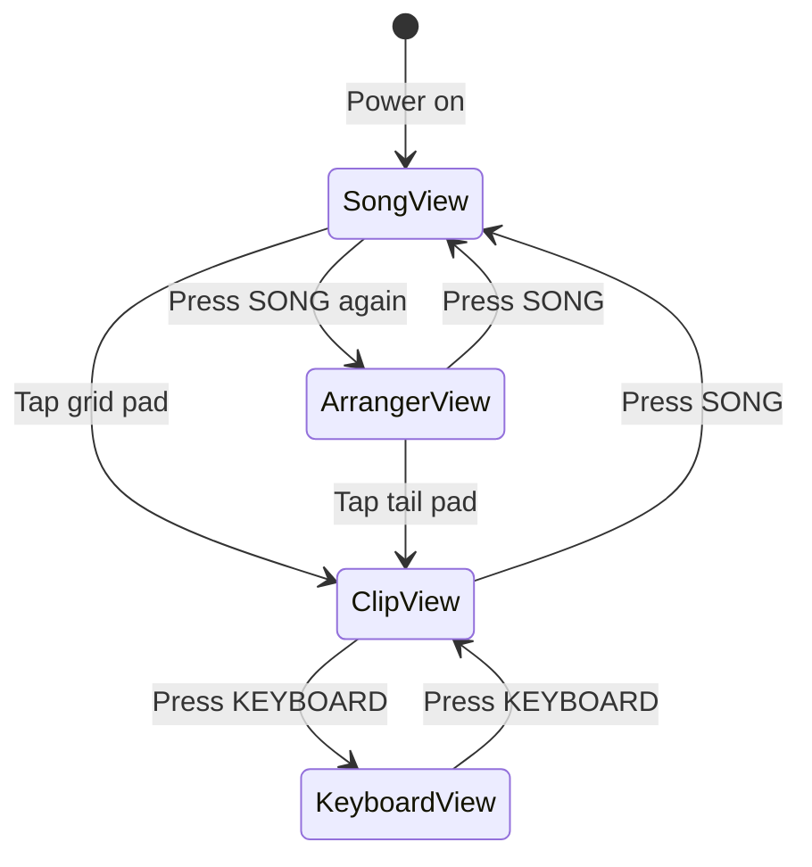

# Deluge Bitwig Controller - Specification Index

Control Bitwig Studio using Deluge in Controller Mode with familiar Deluge workflows.

---

## View Specifications

| Deluge View | Bitwig Entity | Spec Document |
|-------------|---------------|---------------|
| Song View | Clip Launcher | [spec_song_view.md](./spec_song_view.md) |
| Arranger View | Arranger Timeline | [spec_arranger_view.md](./spec_arranger_view.md) |
| Clip View | Note Editor / Drum Machine | [spec_clip_view.md](./spec_clip_view.md) |
| Keyboard View | Isomorphic Keyboard | [spec_keyboard_view.md](./spec_keyboard_view.md) |

## Global Controls
- [spec_global_controls.md](./spec_global_controls.md) - Buttons, encoders, display

---

## View Transitions

---

## Reference Documents

- [Deluge-Guidebook-4p0.txt](../Deluge-Guidebook-4p0.txt) - Deluge UI/UX patterns
- [controller_mode_midi_protocol.md](../controller_mode_midi_protocol.md) - MIDI communication
- [test_controller_mode.py](../test_controller_mode.py) - Protocol examples
